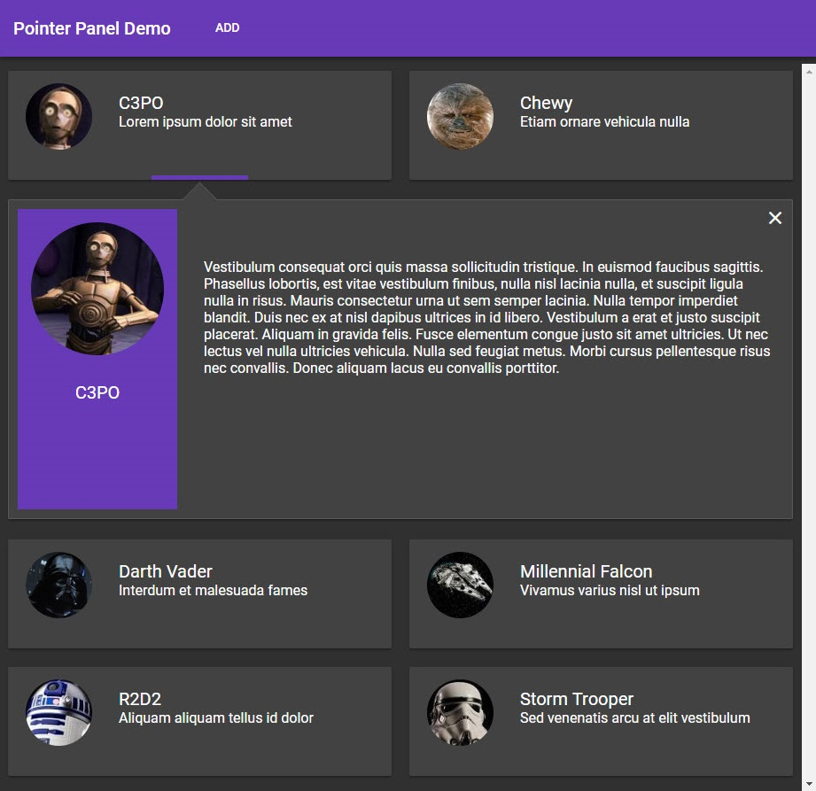

### Pointer Panel – An Angular 15 Component

The pointer panel is a master/detail component that displays a wrapped list of cards and shows details of the selected
card. It has a responsive layout and uses the current material theme. I got the idea from Google images and am using
this component mainly for my portfolio.

Live Demo: https://pointerpaneldemo2.firebaseapp.com/



### Getting Started

Pointer Panel requires a collection of items and two templates as shown below.

```html
<!--ITEM DETAILS TEMPLATE-->
<ng-template #myItemDetailsTemplate let-dataDetails>
  <p>{{dataDetails.jsonData?.fullDesc}}</p>
<ng-template>

<!--ITEM CARD TEMPLATE-->
<ng-template #myItemTemplate let-dataItem>
 <p>{{dataItem.jsonData?.name}}</p>;
</ng-template>;

<!-- POINTER PANEL LIST -->
<pointer-panel-list [itemTemplate]='myItemTemplate'
                    [itemDetailsTemplate]='myItemDetailsTemplate'
                    [dataSource]='cards$'/>
</pointer-panel-list>

…in the .ts file

public cards: Array<StarWarsModel> = new Array<StarWarsModel>();
cards$ = of( this.cards);
 ```

### Managing Data

Pointer panel uses IteratableDiffer based checking to realize if the underlying data has changed to update the UI so
your data changes (such as adding or removing a record) can be inline or return a new collection. For instance, use
push, splice, spread, or slice to modify the data source and the pointer panel will update automatically.

dataSource can be an array or an observable, if an array is used then pointer panel will make its own observable.

### Themes and styles

Pointer panel uses the material theme loaded by the application.

### Responsive

Pointer panel should display properly on all devices.

### Dependencies

Angular 6, Material and ngFlex

### Future Features

Below are the features I would add next:

1. Add ability to show details in column. Would work better for wide screens. It could auto detect or be set via
   properties.
2. Add configurable height to details panel.
3. Add virtualization to the list.
4. Add keyboard support to navigate and select the cards.
